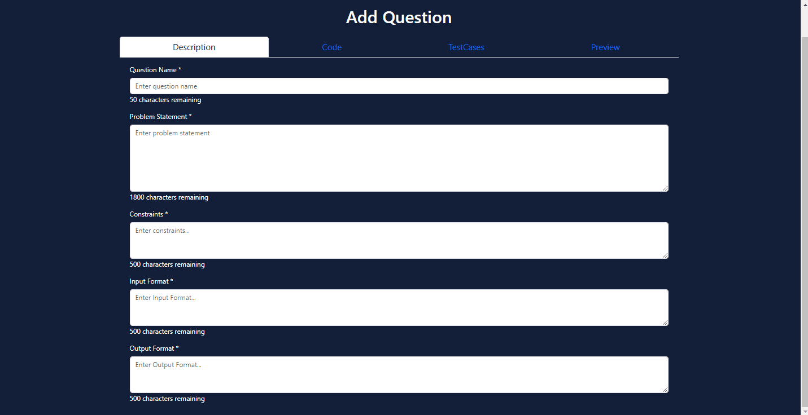
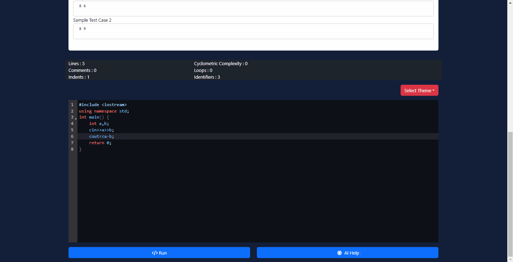
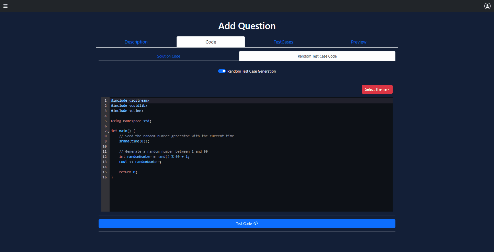
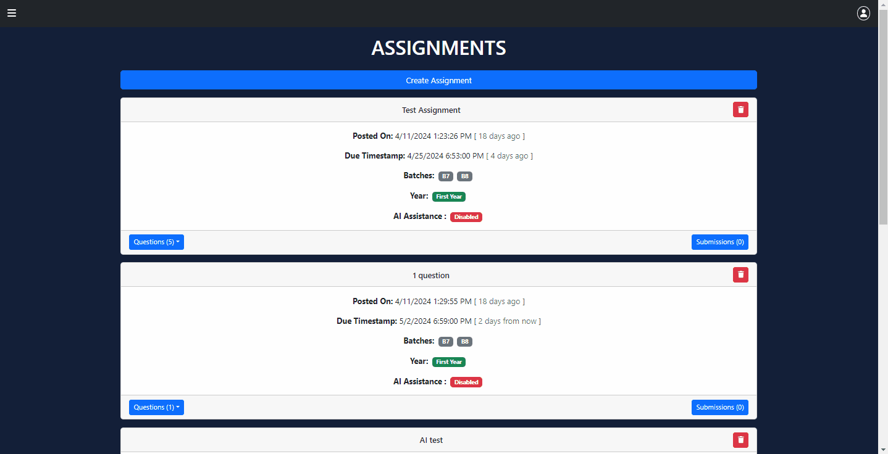
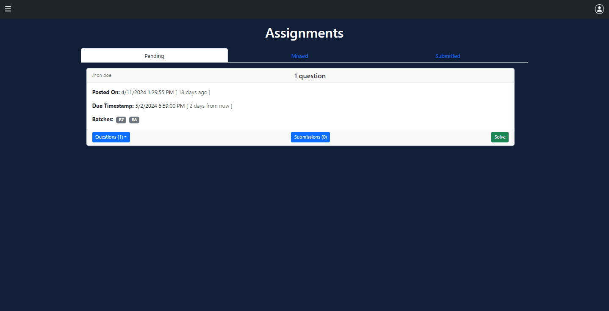
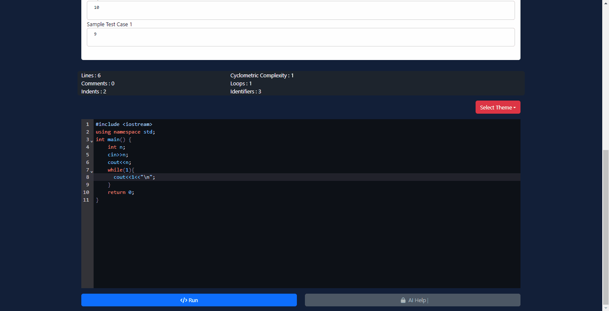
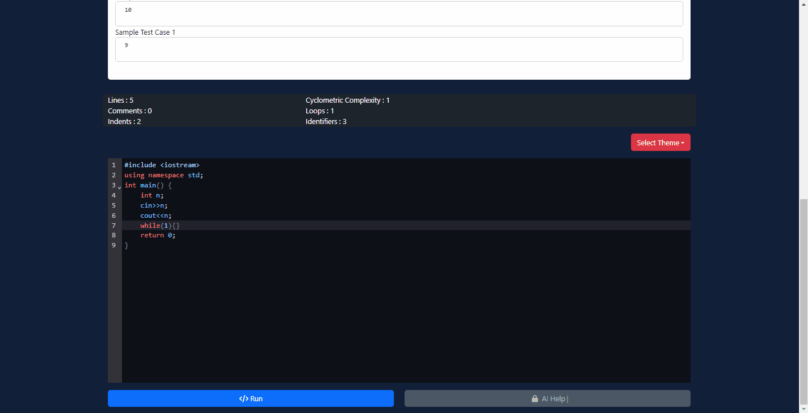
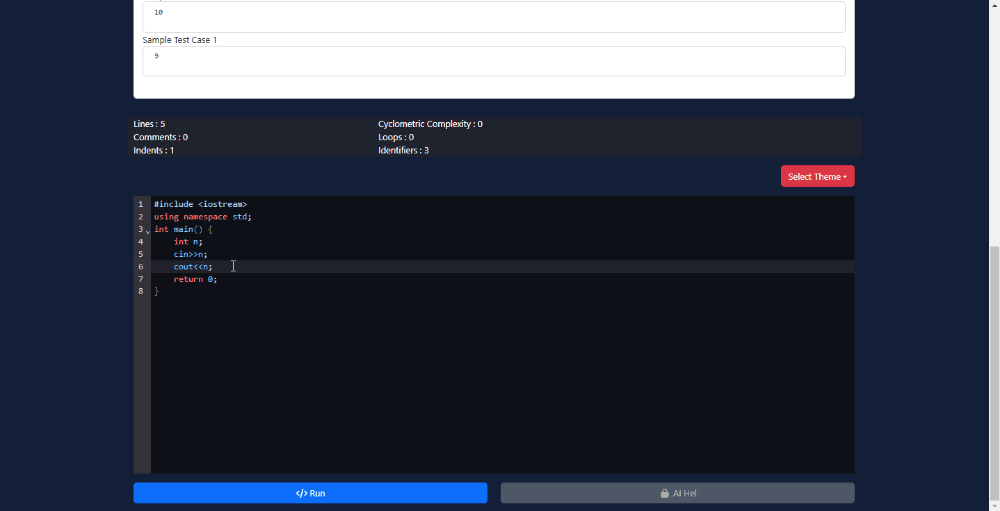
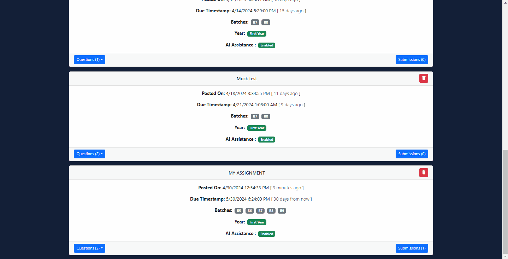

# CodeSphere

you can find the docs here : [Docs](https://sakshamsahgal.github.io/Major-2-CodeSphere/)

## Features Preview : 

### AddQuestion

### AI Assistance

### Random TestCase

### Create Assignment

### TestCaseEvaluation

### CODE EVALUATION

#### Compilation Error

### Memory Limit Exceed

### TLE

### View Submissions

